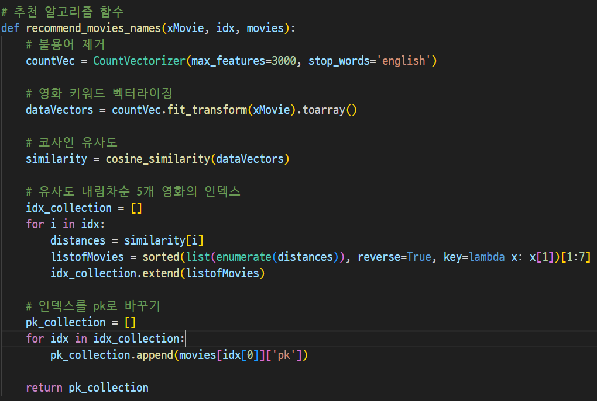
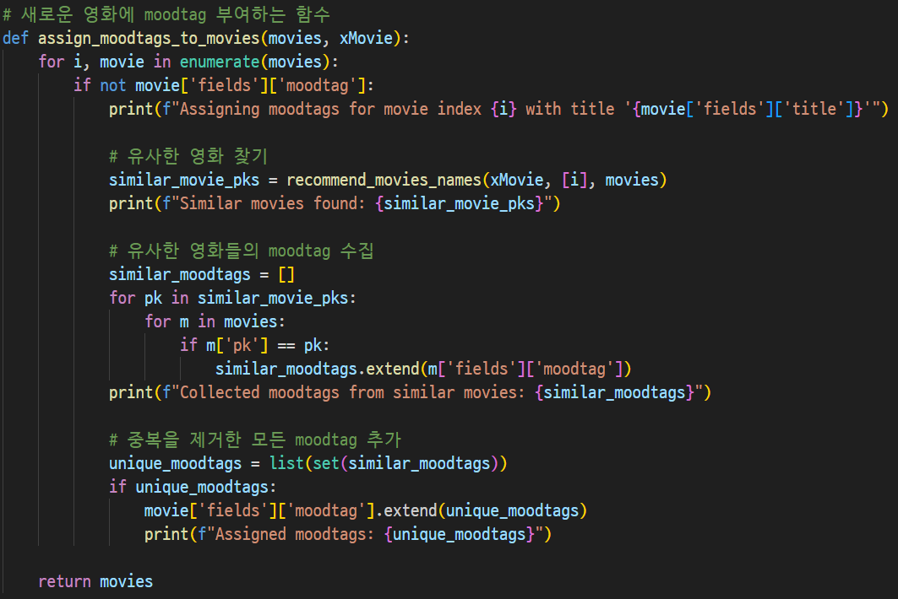
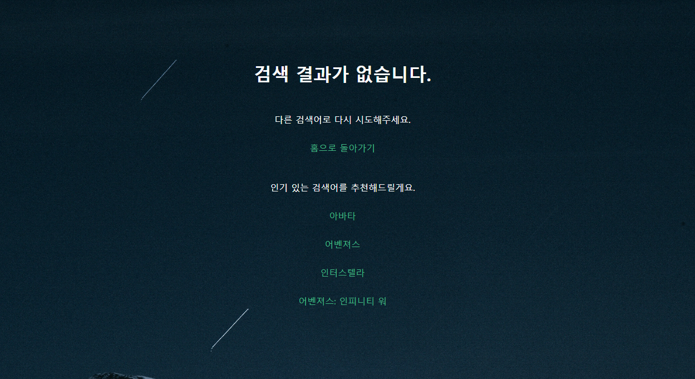

# 프로젝트 G-Flex

### 개발 기간 5/16 ~ 5/24(약 9일간)

## 5/16

### 오늘 한 것
- ERD 작성
- Figma 로 목업 생성
- git branch 로 나누어 작업, push 후 merge 해보기
- Django 프로젝트(mypjt), 앱 (accounts, movies) 생성
- 기본적인 url, views 연결

## 5/17

### 오늘한것
- ERD에 따른 model, model인자, serializer 작성
- views.py 작성
- db생성, 확인
- postman 에서 영화, 영화 상세정보 조회 가능한지 확인
- postman 에서 댓글 조회, 생성, 수정, 삭제 가능한지 확인 (수정, 삭제는 댓글 단 유저 == 본인이어야만 가능)

## 5/20

### 오늘한것
- ERD 수정
- 영화 데이터에 알고리즘으로 moodtag 반영
  - 영화 추천 알고리즘
    - 영화 간의 유사도를 계산하여 유사한 영화를 추천
     
    - 유사한 영화를 기반으로 새로운 영화에 moodtag 할당
     
- Detailview.vue에 댓글 작성 구현

## 5/21

### 오늘한것
- 모든 장르, moodtag를 조회하는 serializer, url, view 작성
- 장르, moodtag에 따라 필터링 하는 serializer, url, view 작성
- GenreView에 연동
- 장르, moodtag(최대 2개) 선택 시 그 태그들을 모두 가지고 있는 영화 반환

## 5/22

### 오늘한것
- GenreView, MovieDetailView, ProfileView CSS 수정
- 영화를 검색했을 때 추천 가능한 영화도 뜨지 않는 경우, NotFoundView 에서 메인 페이지에 인기있는 영화 제목 4개를 랜덤으로 출력(새로고침 할 때마다 변한다.)

  

- 해당 제목을 클릭 했을 때 해당 영화의 Detail 페이지로 이동하도록 구현
- HomeViewLoggedIn component 검색 창 CSS 수정

## 5/23

### 오늘한것
- 마이페이지에서 좋아요 누른 영화 개수 출력
- ProfileView CSS 수정
- 서비스 모든 기능 double check

### 하지 못한 것
- 검색어 자동완성 기능

