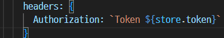
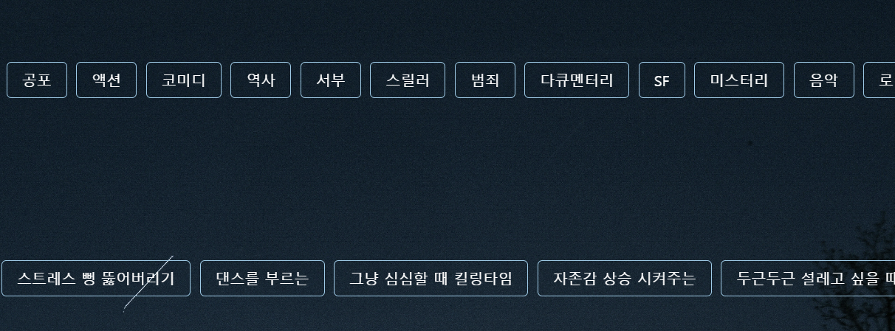
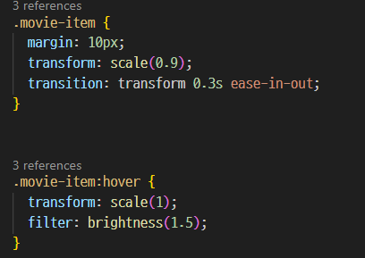
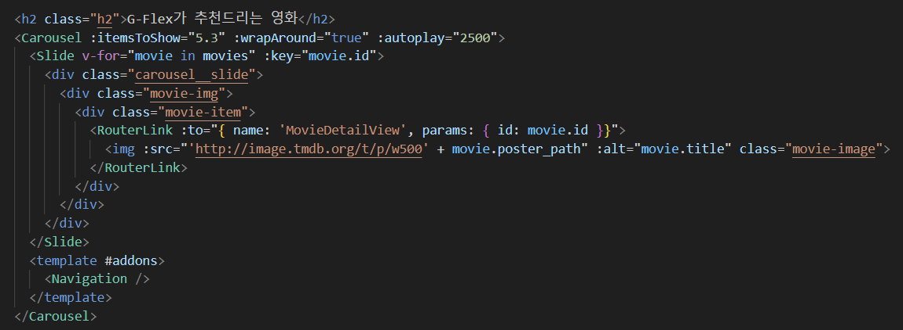
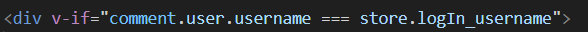
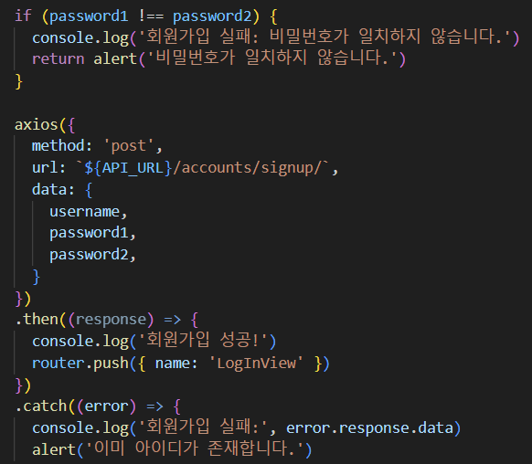

# 프로젝트 G-Flex

### 개발 기간 5/16 ~ 5/24(약 9일간)

## 5/16 

### 오늘 한 것
- Figma 로 목업 생성
- 데이터 추출
- git branch 로 나누어 작업, push 후 merge 해보기
- Vue Login / LogOut / SignUp 기능 구현
- 메인페이지 컴포넌트 생성 및 연결
- 로그인 했을 시 토큰을 이용하여 Vue에서 Django로 넘겨주었음.
</img>

## 5/17

### 오늘 한 것
- 데이터 전처리
- Populatiy rate가 50 이상인 것으로만 추출
- 기본적인 css 구조 적용
- MoiveDetailView 화면 영화포스터 / 영화 정보 출력
- GenreView.vue에 장르/무드 카테고리 선택 출력 
- 
- 로그인 했을시와 안했을시 홈 화면 다르게 출력

## 5/20
  
### 오늘 한 것
- 영화 검색했을 경우 관련된 영화를 출력
- 영화 검색했을 경우 데이터베이스에 없는 영화라면 NotFoundView.vue 페이지로 넘어가기
- ProfileView.vue에 좋아요를 누른 영화 출력
- 각 페이지 CSS 적용 (MovieDetailView, ProfileView, NotFoundView, HomeViewLoggedIn)
- 영화 포스터에 마우스 가까이 갈 시 포스터 커지고 밝기 밝게하기
</img>

### 하지 못한 것
- 댓글 작성시 마이페이지에 댓글 작성한 영화 출력

## 5/21

### 오늘 한 것
- 장르 선택시 색깔 변화 적용
- 무드 선택 3개 이상은 못하도록 설정
- Vue carousel을 이용하여 css 적용
- 
  - itemsToShow="5.3" : 한칸에 5.3개의 영화 포스터를 출력 
  - :autoplay="2500" : 2.5초마다 화면이 바뀐다.

## 5/22

### 오늘 한 것
- 댓글 수정 기능 중 내가 작성하지 않은 댓글에 수정/삭제 버튼이 보임.
- 해결하였음.
- 
- username이 같다는 것을 이용하여 해결 완료
- css 기능 추가
- 홈 화면 인트로 애니메이션 추가(Gflex.vue)
- 로그인 되어있을때와 로그인 안되어 있을 떄 홈 화면 애니메이션 추가
- 회원가입시 어떤 점으로 인해 회원가입이 되지 않는지 alert 띄우기
- 

### 하지 못한 것
- 좋아요 클릭시 하트 색깔 바뀌는 것 하지 못했음.
- 자동 완성 기능 하지 못했음.

## 5/23

### 오늘 한 것
- 좋아요 버튼 누를시 색깔  바뀌는 것 해결 하였음.
- 댓글 달 시 댓글 수와 댓글 제한 수 추가
- 100글자 넘을시 alert 띄우기

### 하지 못한 것
- 검색어 자동완성 기능
