# 프로젝트 'G-Flex'

## 프로젝트 개요

---

</img>

</img>

</img></img>

- 진행 기간 : 2024.05.16 ~ 2024.05.24 오전 9시 (9일간) 
- 목표 
  - 검색을 통한 영화 추천서비스 개발
  - 사용자에게 다양한 경험을 제공
  - 장르 및 무드에 따른 영화 추천 서비스 제공

---
## 팀원 정보 및 업부 분담 내역
- 김구태 - 백엔드
  - 사용 Tool : Django
- 구현우 - 프론트엔드
  - 사용 Tool : Vue3

---
## ERD

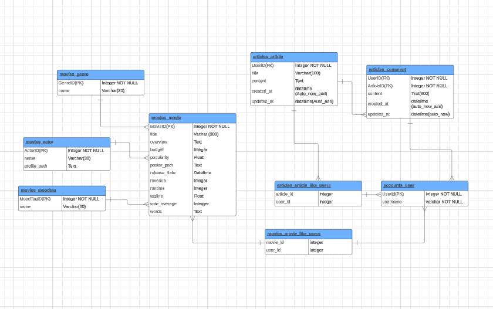</img>

---

## 우리 서비스 필수 기능

1. 사용자의 검색한 영화와 데이터 베이스 내 영화들의 키워드 유사도 방식을 통해 추천하는 알고리즘
2. 장르, 무드별 태그를 선택했을 때 그에 맞는 영화 추천 제공
3. 영화 포스터 클릭시 영화 정보 제공
4. 영화 리뷰 작성 / 수정 / 삭제 가능
5. 기본적인 회원가입, 로그인, 로그아웃
6. 프로필 페이지

## 서비스 구성 화면

### accounts app
---
  ### 화면 인트로
</img>
    - 애니메이션 효과 삽입
  ---

  ### 회원가입
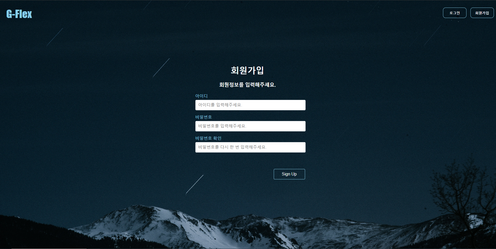</img>
---

  ### 로그인
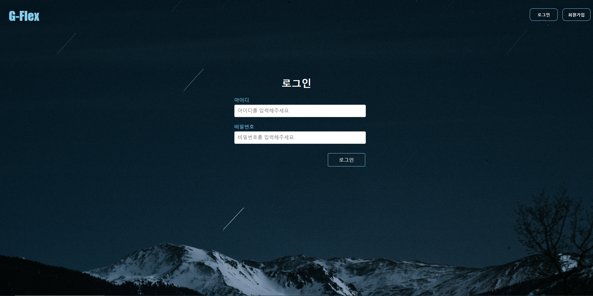</img>
---

  ### 로그아웃
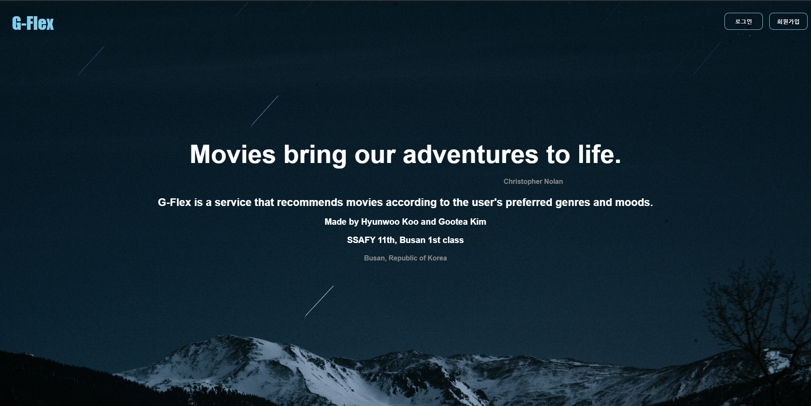</img>
---

### movies app
---
  ### 홈 화면
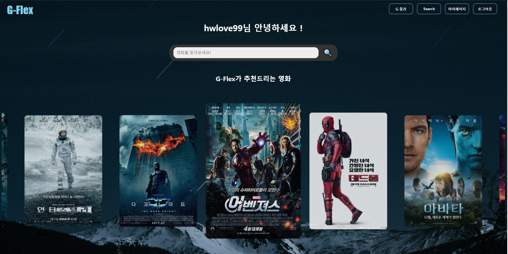</img>
- G-Flex가 추천하는 영화
---

  ### 장르별 영화 데이터 가져오기
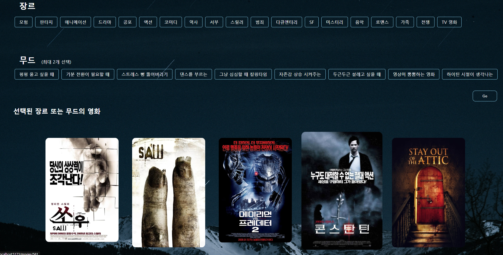</img>
- 공포 장르를 선택 했을 때의 추천 영화
---
  
  ### 무드별 영화 데이터 가져오기
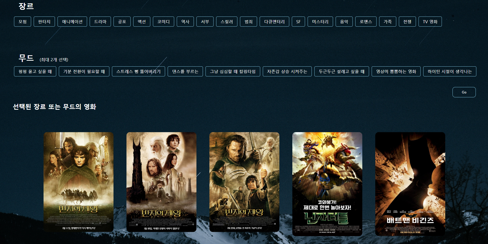</img>
- 그냥 심심할때 킬링타임 무드를 선택 했을 때의 추천 영화 
---

  ### 영화 좋아요 / 좋아요 취소 
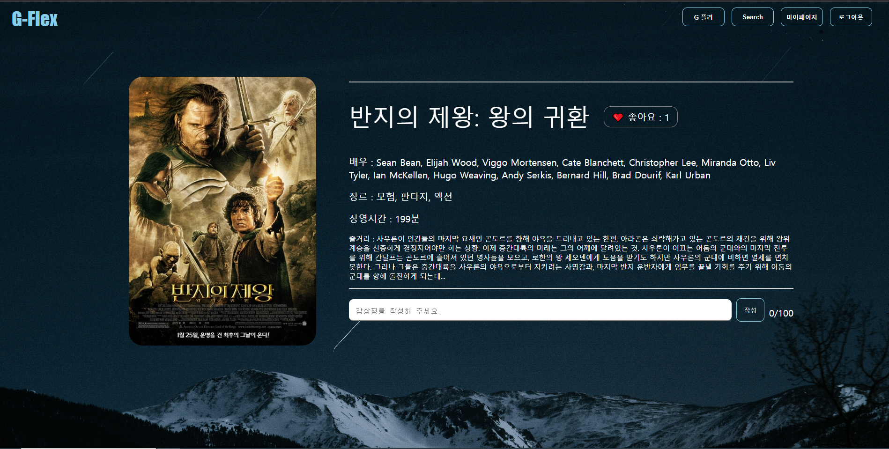</img>
---
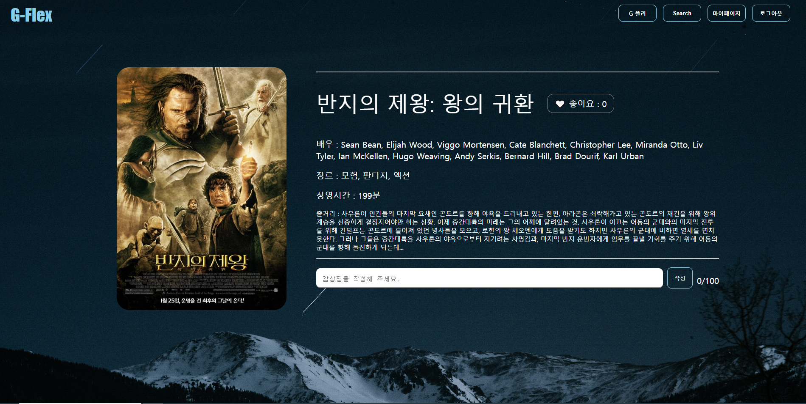</img>
- 좋아요 눌렀을때와 안 눌렀을때의 좋아요 색 차이
---

  ### 검색한 영화와 유사한 영화 데이터 가져오기
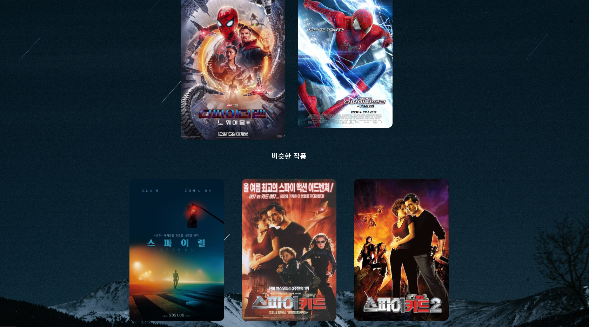</img>
- ex 스파이더맨 검색했을 경우, 스파이더맨과 유사한 영화 추천서비스
---

  ### 영화 디테일 페이지
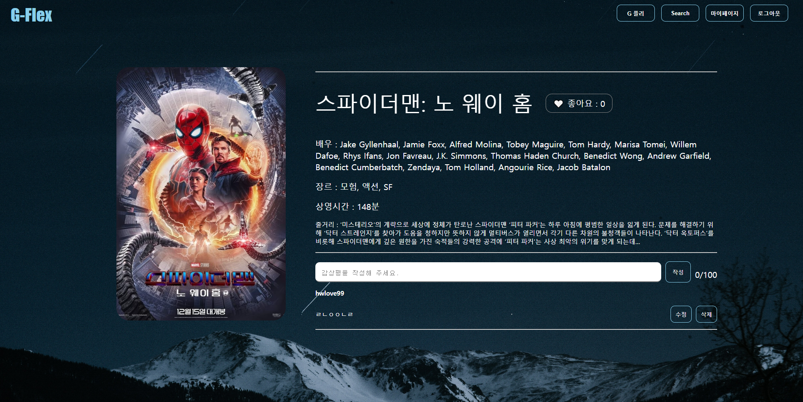</img>
- 영화 포스터 클릭시 영화 제목, 배우, 장르, 런타임, 줄거리 소개
- 영화 리뷰 작성 가능, 수정 / 삭제 기능
- 영화 리뷰 작성시 글자 수 출력
- 100글자 이상 시 alert 출력
---

  ### 마이페이지
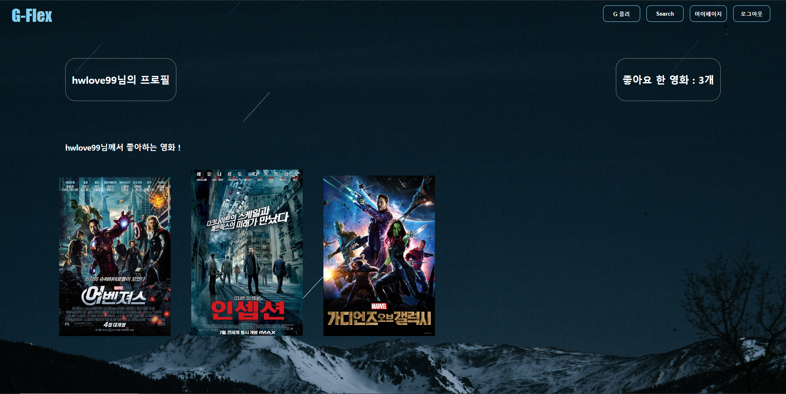</img>
- 좋아요 누른 영화 출력
- 좋아요 누른 영화가 몇개인지 ? 

---

## 느낀 점 

### 김구태

  1월달에 입과하면서 과연 마지막 프로젝트까지 버틸 수 있을까 걱정했다. 하지만 1월에 비하면 다소 많이 성장했다고 생각한다. 파이썬 반복문, 조건문을 이해하지도 못했지만 실습, 매주 프로젝트, 스터디를 하면서 다른 동기들 보다는 다소 느리지만 천천히 과정에 따라갔다. 그 결과 마지막 프로젝트를 할 수 있었다. 
  8,9번째 관통 프로젝트 때 JS와 Vue를 활용한 프로젝트를 하면서 JS와 Vue에는 아직 부족한 부분이 많다고 생각했다. 그래서 상대적으로 자신있는 django를 활용하기 위해 백엔드를 맡았다.
  django에서 url, view를 연결하는 것은 완벽하게 이해했지만, serializer를 작성할 때에는 참조, 역참조 부분에는 다소 약하다는 것을 확인 할 수 있었다. postman으로 직접 데이터를 눈으로 확인하는 것이 serializer, model을 구성할 때 쉽다는 것을 느꼈다.

  프로젝트 기획을 할 때 현우와 가장 기초적인 요구사항만 만족하도록 프로젝트를 진행하자고 했다. 대학생활 동안 프로젝트의 목표를 너무 높게 잡은 나머지 프로젝트를 다 완성하지도 못하고, 시간도 날린 경험이 있었기 때문에 이번에는 기본적인 기능부터 다 구현한 후, 시간이 된다면 더 필요한 기능을 추가하는 방식으로 프로젝트를 진행했다.
  django 파트를 다 한 후 현우를 도와 Vue와 CSS 수정을 했다. 확실히 Vue에 조금 자신이 없다는 것을 느꼈다. 하지만 페이지와 console에 출력하고 싶은 값을 직접 눈으로 확인하고, 에러를 개발자도구에서 직접 확인한 후 디버깅 하는 것이 코드를 작성하는 데에 많이 도움된 다는 것을 알게 되었다.

  처음에는 둘이서 같이 django를 다 끝내고 vue 작업을 하는 방식으로 프로젝트를 진행하려고 했다. 하지만 현우의 신의 한수로 나는 백엔드, 현우는 프론트 엔드를 맡았다. 그 결과 작업 속도가 더욱 더 빨라졌고, 시간이 조금 남아서 피드백 받았던 기능들을 조금 더 보완 할 수 있었다. 기획, 역할 분담, 소통이 팀 프로젝트에서 매우 중요하다는 것을 느꼈다. 또한 팀원과의 관계 또한 매우 중요하다고 생각했다. 학기 시작할 때부터 현우와 가깝게 친했기 때문에 더욱 더 서스름 없이 소통하고, 피드백 할 수 있었다. 그 덕분에 기획한 대로 프로젝트를 잘 마무리 할 수 있었다.

  현재까지도 아직 프론트 엔드, 백엔드를 고민하고 있다. 이번 프로젝트를 통해서 백엔드, 프론트엔드를 둘 다 경험해보면서 많은 도움이 되었다고 생각한다. 

---
### 구현우

  처음 코딩을 시작 했을때, if문 for문이 무엇인지도 몰랐던 코드를 작성하면서 이해조차 되지 않았지만, 실행이 되었기에 왜 실행이 된지도 모르고 코드를 써내려 갔다. 처음에 마지막 월말평가는 프로젝트를 하는것이라는 말을 듣고 과연 할 수 있을지 ? 의구심이 들기도 하였고, 그때는 10줄 코드 쓰는것도 힘들어서, 진행 조차 할 수 있을지 몰랐다. 
  막상 프로젝트를 해본 결과, 한 컴포넌트에 200줄 300줄은 기본이고, 한 화면을 구성하는 것 조차 쉽지않고 버거웠다는 것을 느꼈다. 이번에 내가 일주일 동안, 작성한 코드로 인해 결과물이 하나하나씩 채워지는 것을 보니 css에 재미를 들린 것 같다. 이번 프로젝트를 하면서 평소에 많이 보았던 사이트들이 어떤 css를 가지고 있는지 어떤 구조인지 다시 한 번 생각하게 되었던것 같다. 그리고 백엔드 개발을 해주는 구태가 없었더라면, 프론트 개발 조차 되지 않았기에 혼자 하면 할 수 없었던 이 프로젝트를 같이해서 성공적으로 마칠 수 있었던 것 같다. 이번 프로젝트를 통해 협력에 대해 다시 한번 더 생각하게 되었다.

