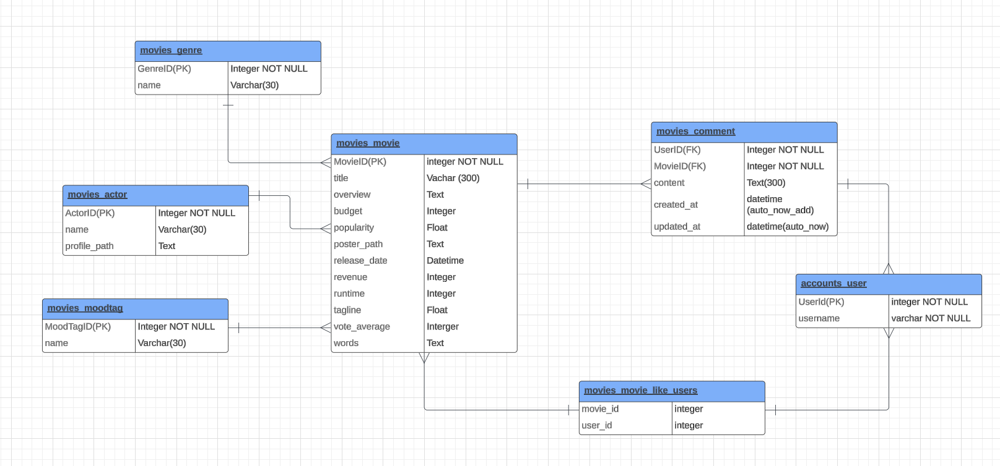

# 프로젝트 'G-Flex'

### 프로젝트 개요

---

</img>

</img>

</img></img>

- 진행 기간 : 2024.05.16 ~ 2024.05.24 오전 9시 (9일간) 
- 목표 
  - 검색을 통한 영화 추천서비스 개발
  - 사용자에게 다양한 경험을 제공
  - 장르 및 무드에 따른 영화 추천 서비스 제공

## 팀원 정보 및 업부 분담 내역
- 김구태 - 백엔드
  - 사용 Tool : Django
- 구현우 - 프론트엔드
  - 사용 Tool : Vue3

### ERD

</img>

## 시연 영상 
- 넣을 예정

## 서비스 구성 화면

- accounts app
  - 회원가입
  - 로그인
  - 로그아웃
  - 프로필 데이터 가져오기

- articles app
  - 게시글 작성
  - 전체 게시글 조회
  - 단일 게시글 조회
  - 단일 게시글 수정
  - 단일 게시글 삭제
  - 댓글 생성
  - 댓글 수정
  - 댓글 삭제

- movies app
  - 배우 전체 데이터 가져오기
  - 단일 배우 데이터 가져오기
  - 장르별 영화 데이터 가져오기
  - 기분별 영화 데이터 가져오기
  - 영화 좋아요 / 좋아요 취소 
  - 사용자가 좋아요 누른 영화와 유사한 영화 데이터 가져오기
  - 특정 영화와 유사한 영화 데이터 가져오기
  - 검색한 영화와 유사한 영화 데이터 가져오기
---

## 우리 서비스 필수 기능

1. 사용자의 검색한 영화와 데이터 베이스 내 영화들의 키워드 유사도 방식을 통해 추천하는 알고리즘
2. 장르, 기분별 태그를 선택했을 때 그에 맞는 무비 플레이 리스트 제공
3. 사용자들 간의 커뮤니케이션이 가능한 게시판
4. 기본적인 회원가입, 로그인, 로그아웃

## 느낀 점 

- 김구태 -
- 구현우 - 

